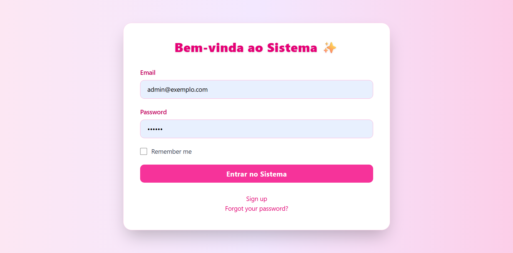
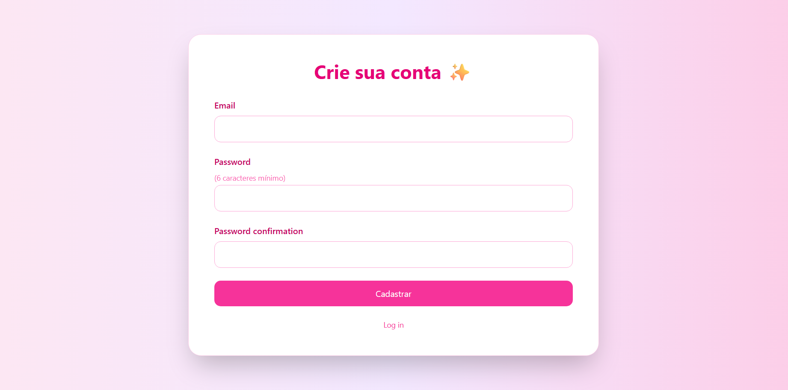
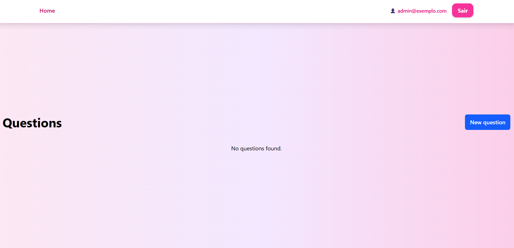
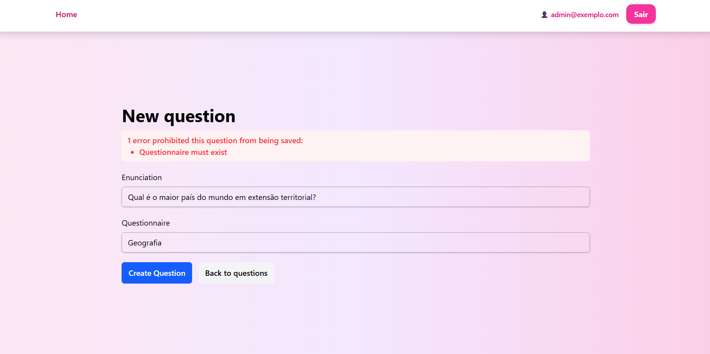
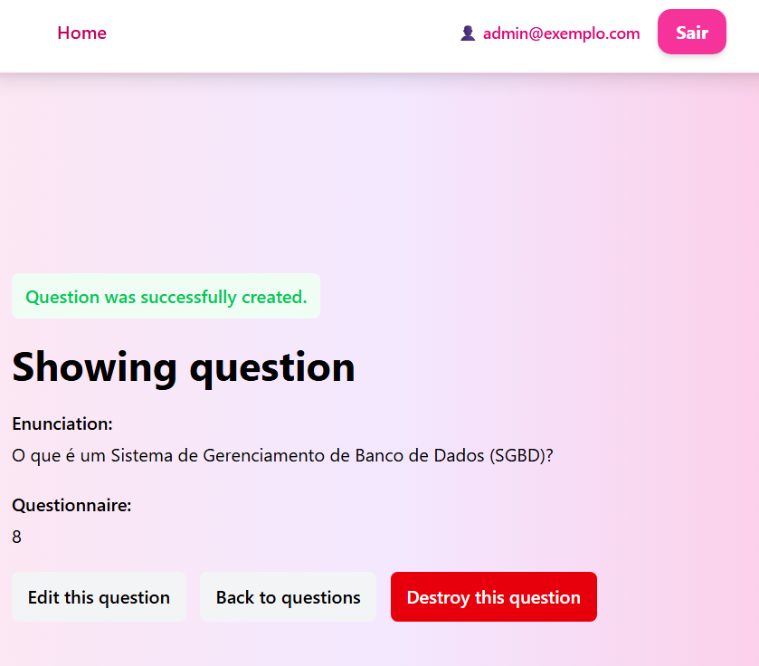
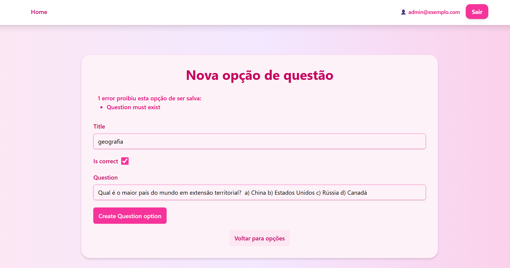
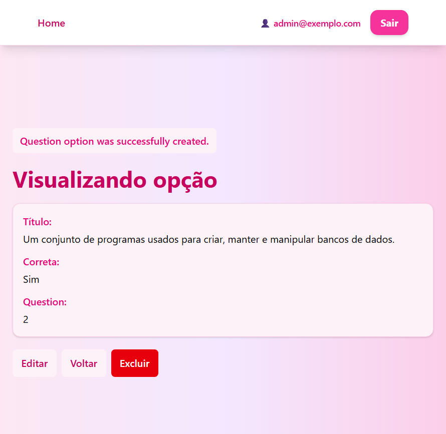

Perfeito, Yasmim 💚
Aqui está o **README.md completo, formatado e pronto para colar no GitHub**, com badges, emojis, seções bem organizadas e estilo profissional — mantendo tudo que você pediu.

---

````markdown
# 📚 Code Quiz

> Sistema de questionários e avaliações online desenvolvido em **Ruby on Rails**.  
> Permite criar, responder e gerenciar questionários com controle de acesso por perfis de usuário.

---

## 🌐 Acesso Local
🔗 **URL:** [http://localhost:3000](http://localhost:3000)

---

## 🧾 Sobre
O **Code Quiz** é uma aplicação web voltada para o gerenciamento de **questionários de múltipla escolha**.  
O sistema implementa autenticação com diferentes **níveis de acesso** (admin, moderador e aluno), além de funcionalidades como:

- Criação e edição de questionários e questões  
- Cadastro e login de usuários  
- Recuperação de senha via e-mail  
- Controle de permissões por papel  
- Interface simples e intuitiva  

---

## 🛠 Tecnologias Utilizadas
| Tecnologia | Descrição |
|-------------|------------|
| 🩷 **Ruby on Rails** | Framework principal da aplicação |
| 🐘 **PostgreSQL** | Banco de dados relacional |
| 🧩 **Devise** | Sistema de autenticação |
| 🔒 **Pundit** | Gerenciamento de permissões (roles) |
| 🎨 **TailwindCSS / Bootstrap** | Estilização e layout responsivo |
| ✉️ **Letter Opener Web** | Visualização de e-mails em ambiente de desenvolvimento |

---

## 👥 Perfis de Usuário

### 👑 **Administrador**
- Acesso completo ao sistema  
- Gerencia questionários, questões e usuários  

### 🧑‍💼 **Moderador / Professor**
- Pode criar, editar e excluir apenas seus próprios questionários  
- Visualiza resultados dos questionários que criou  

### 👨‍🎓 **Aluno**
- Pode responder questionários  
- Visualiza apenas seus resultados pessoais  

---

### 🔐 **Usuários de Teste**

| Perfil | E-mail | Senha |
|--------|---------|--------|
| 👑 Admin | admin@exemplo.com | 123456 |
| 🧑‍💼 Professor | moderador@exemplo.com | 123456 |
| 👨‍🎓 Aluno | aluno@exemplo.com | 123456 |

---

## 🖼️ Telas do Sistema

### 🔑 Login / Inicial


### 📝 Cadastro


### 🔄 Recuperação de Senha


### 🏠 Home (Pós-Login)


---

### 📋 Questionários

**Lista de Questionários**  


**Novo Questionário**  


**Ver / Editar / Excluir**  


---

### ❓ Questões

**Lista de Questões**  


**Nova Questão**
- Sem questionário vinculado:  
    
- Com questionário vinculado:  
  

**Opções de Questões**
- Sem opções:  
  
- Com opções:  
  

  ### 🖥️ Aluno
**Tela Inicial**  


**Lista de Questionários**  


---

## 🗓️ Entrega

📅 **Data da Entrega:** 20/10/2025  
🎥 **Apresentação:** Presencial ou vídeo demonstrativo (3–5 minutos)  
💾 **Envio:** Via **GitClassroom**

---

## 🚀 Passo a Passo — Instalação e Execução

1. **Clone o repositório**
   ```bash
   git clone https://github.com/seuusuario/code_quiz.git
   cd code_quiz
````

2. **Instale as dependências**

   ```bash
   bundle install
   yarn install
   ```

3. **Configure o banco de dados**
   Edite o arquivo `config/database.yml` com suas credenciais do PostgreSQL.

4. **Crie e migre o banco**

   ```bash
   rails db:create db:migrate db:seed
   ```

5. **Inicie o servidor**

   ```bash
   rails s
   ```

6. **Acesse no navegador**

   ```
   http://localhost:3000
   ```

---

## 🧑‍💻 Autores

Desenvolvido por **Yasmim Russi Mariano**
💚 Curso: *Análise e Desenvolvimento de Sistemas — IFPR (2024–2025)*

---

## 🪪 Licença

Este projeto é de uso educacional e não possui fins comerciais.


